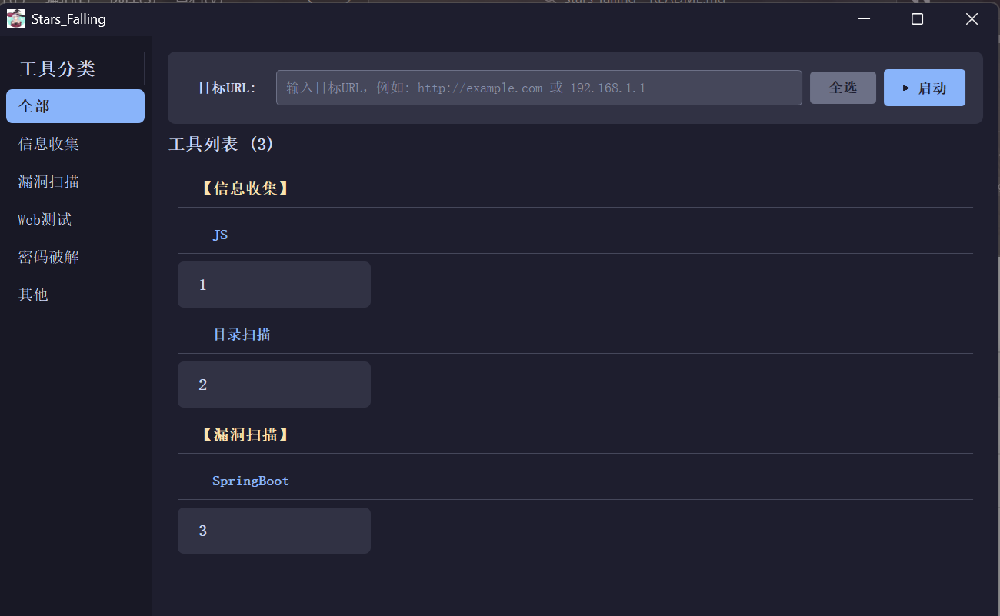
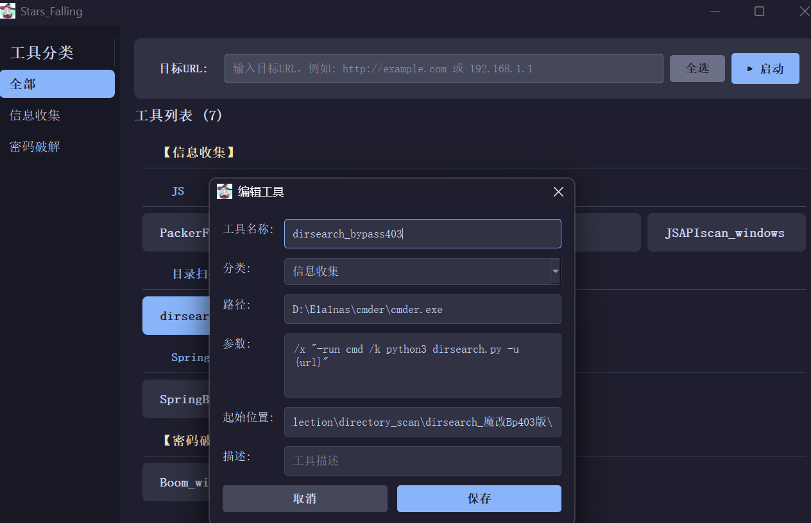

# Stars Falling

<p align="center">
  <b>渗透测试工具启动器</b>
</p>
<p align="center">
  
  

<p align="center">
  
</p>


---


## 简介

**Stars Falling** 是一款专为渗透测试人员设计的工具管理和启动器。提供简洁美观的深色主题界面，帮助安全研究人员高效地组织、管理和批量启动各类渗透测试工具。

## 功能特性

- **分类管理** - 自定义工具分类和子分类，灵活组织工具
- **工具卡片** - 直观的卡片式展示，支持拖拽排序
- **批量执行** - 选中多个工具，输入目标后一键启动
- **配置持久化** - 所有配置自动保存为 JSON 文件
- **深色主题** - 护眼的深色界面设计

## 使用方法

### 基本操作

| 操作 | 说明 |
|------|------|
| 右键空白处 | 添加工具 / 添加子分类 |
| 右键工具卡片 | 编辑 / 删除 / 复制到其他分类 |
| 右键分类按钮 | 重命名 / 删除分类 |
| 双击工具卡片 | 快速编辑工具 |
| 拖拽 | 调整工具、子分类、分类的顺序 |
| 点击工具卡片 | 选中/取消选中 |

### 添加工具

1. 右键工具区域空白处，选择"添加工具"

2. 填写工具信息：
   - **工具名称** - 显示名称
   
   - **分类** - 所属分类
   
   - **工具路径** - 可执行文件路径，个人使用的cmder（留空则使用 CMD 窗口执行）
   
   - **命令参数** - 使用 `{url}` 作为目标占位符
   
   - **起始位置** - 执行文件所处目录
   
   - **描述** - 工具说明（可选）
   
     <p align="center">
       
     </p>

### 执行工具

1. 选择分类或在"全部"中浏览
2. 点击选中需要执行的工具
3. 在顶部输入目标 URL
4. 点击"执行选中工具"

### 命令参数示例

```
nmap -sV -sC {url}
sqlmap -u {url} --batch
dirsearch -u {url}
```

## 安装

### 方式一：直接下载 EXE

从 [Releases](../../releases) 页面下载 `stars_falling.exe`，双击运行即可。

### 方式二：从源码运行

```bash
git clone https://github.com/yourusername/stars_falling.git
cd stars_falling
pip install -r requirements.txt
python main.py
```

## 

## 技术栈

- **Python 3.x**
- **PyQt5**
